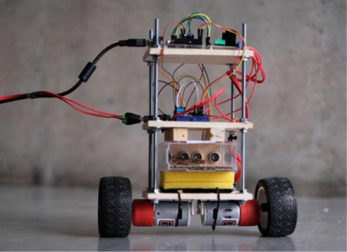
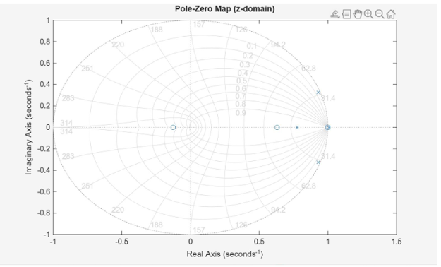
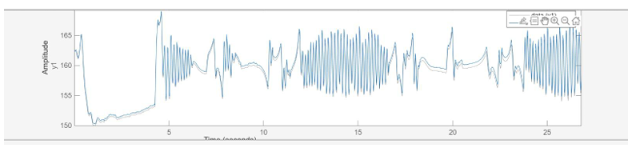

# 🤖 Self-Balancing Robot Using PID Control


A two-wheeled self-balancing robot designed and implemented as part of **NANENG 212 – Applied Digital Control** at **Zewail City of Science and Technology**.

This project combines **control theory, dynamic system modeling, sensor fusion, embedded systems, and real-time feedback control** to stabilize an inherently unstable inverted pendulum system. The robot continuously measures its orientation and applies corrective motor actions through a PID controller to maintain an upright position.

---

## 📸 Results Gallery

### Hardware Implementation

<p align="center">
  
</p>

### MATLAB Pole-Zero Analysis

<p align="center">
  
</p>

### System Response Analysis

<p align="center">
  
</p>


---

## 🎯 Project Objective

The objective of this project is to design and implement a self-balancing robot capable of maintaining vertical stability using closed-loop feedback control.

The system integrates:

- PID Control
- IMU-Based Angle Measurement
- Sensor Fusion Techniques
- PWM Motor Control
- Dynamic System Modeling
- Real-Time Feedback Correction

The robot continuously measures its tilt angle, computes the balancing error, and adjusts motor speed accordingly to maintain equilibrium.

---

## 🧠 Engineering Concepts

This project applies several important concepts in control engineering:

- Inverted Pendulum Dynamics
- PID Controller Design
- State-Space Modeling
- Stability Analysis
- Pole-Zero Analysis
- Feedback Control Systems
- Sensor Fusion
- DC Motor Modeling
- Embedded Control Systems
- Real-Time System Response

---

## ⚙️ System Architecture

```text
Setpoint
    ↓
Error Calculation
    ↓
PID Controller
    ↓
Motor Driver
    ↓
DC Motors
    ↓
Robot Dynamics
    ↓
IMU Feedback
    ↺
```

The robot operates as a closed-loop control system where the measured tilt angle is continuously fed back to the controller for real-time correction.

---

## 📐 Mathematical Modeling

The self-balancing robot is modeled as a two-wheeled inverted pendulum.

The mathematical framework includes:

- DC Motor Modeling
- Newtonian Dynamics
- State-Space Representation
- Small-Angle Approximation
- Feedback Linearization

The complete model describes the relationship between motor torque, wheel motion, chassis angle, and external disturbances.

---

## 🔄 Control Strategy

The balancing algorithm is based on a PID controller.

### Proportional (P)

Responds to the current balancing error.

- Improves response speed
- Reduces immediate deviation

### Integral (I)

Accumulates previous errors.

- Eliminates steady-state error
- Compensates for system bias

### Derivative (D)

Predicts future behavior from the error rate.

- Reduces oscillations
- Improves overall stability

The controller output is converted into PWM signals that drive the motors and maintain balance.

---

## 📊 System Response

The robot continuously performs the following cycle:

1. Read IMU sensor data.
2. Estimate robot angle using sensor fusion.
3. Calculate balancing error.
4. Compute PID control action.
5. Generate motor control signals.
6. Apply correction through DC motors.
7. Repeat the process in real time.

This feedback loop enables the robot to recover from disturbances and maintain upright stability.

---

## 🛠 Tools & Technologies

### Software

- MATLAB
- Control System Toolbox
- State-Space Modeling
- PID Tuning Tools
- Arduino IDE (C/C++)

### Hardware

- IMU Sensor
- DC Motors
- Motor Driver
- Arduino-Based Embedded Controller
- Battery Power System

### Engineering Topics

- Control Systems
- Embedded Systems
- Sensor Fusion
- Dynamic Modeling
- Mechatronics

---

## 📈 Key Outcomes

- Developed a mathematical model of a self-balancing robot.
- Implemented PID-based stabilization.
- Performed pole-zero and stability analysis.
- Evaluated system response characteristics.
- Applied sensor fusion for angle estimation.
- Integrated hardware and software components into a complete control system.
- Demonstrated successful real-time balancing operation.

---

## 🎥 Demonstration

A video demonstration of the working system is available below:

🔗 https://drive.google.com/file/d/17sNFEkE1AbCxhY8EV_Mhj1L5gyV5NEQX/view

---

## 📂 Repository Structure

```text
Self-Balancing-Robot/
│
├── README.md
├── Report.pdf
├── MATLAB_Model.slx
├── Arduino_Firmware.ino
│
├── images/
│   ├── robot-construction.jpg
│   ├── pole-zero-map.png
│   └── system-response.png
│
└── Additional_Files/
```

---

## 🎓 Course Information

| Item | Description |
|--------|------------|
| Course | NANENG 212 – Applied Digital Control |
| University | Zewail City of Science and Technology |
| Semester | Spring 2026 |
| Project Type | Undergraduate Team Project |
| Repository Purpose | Engineering Portfolio Documentation |

---

## 🏷 Keywords

Control Systems • PID Control • Self-Balancing Robot • MATLAB • Arduino • State-Space Modeling • Sensor Fusion • Inverted Pendulum • Embedded Systems • Dynamic Systems • Mechatronics • Feedback Control

---

## 👥 Attribution

This repository documents a collaborative undergraduate academic project completed as part of **NANENG 212 – Applied Digital Control**.

The original design, implementation, and report were prepared by the project team. This repository is maintained individually as part of a professional engineering portfolio and serves to document the project's methodology, implementation, and results.

---

## 📄 License

No license. Educational and portfolio use only.
